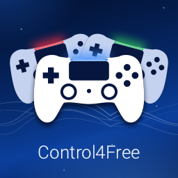
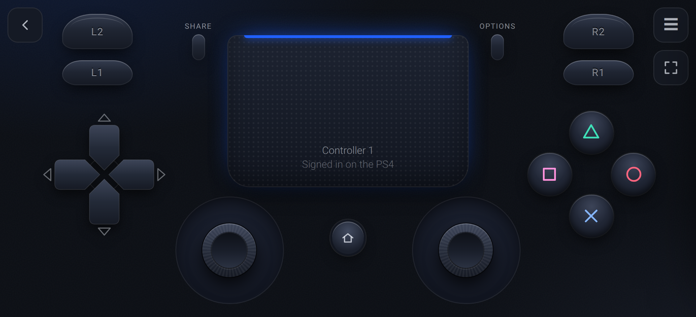
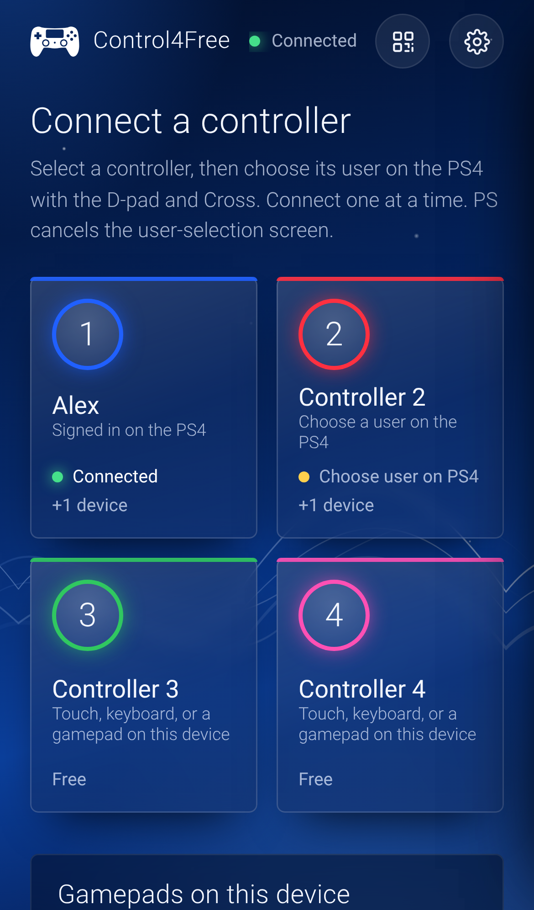
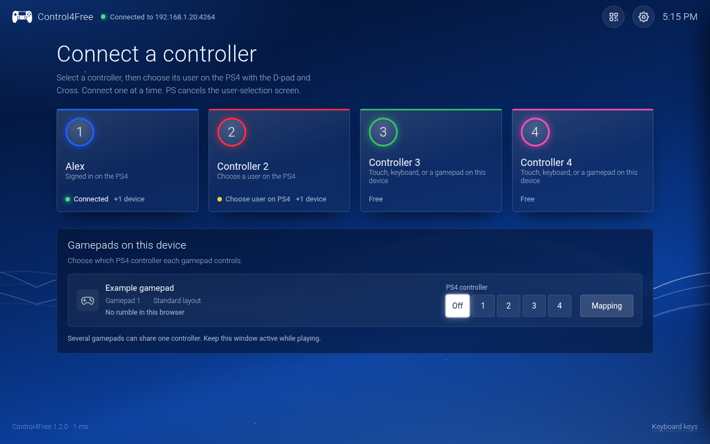
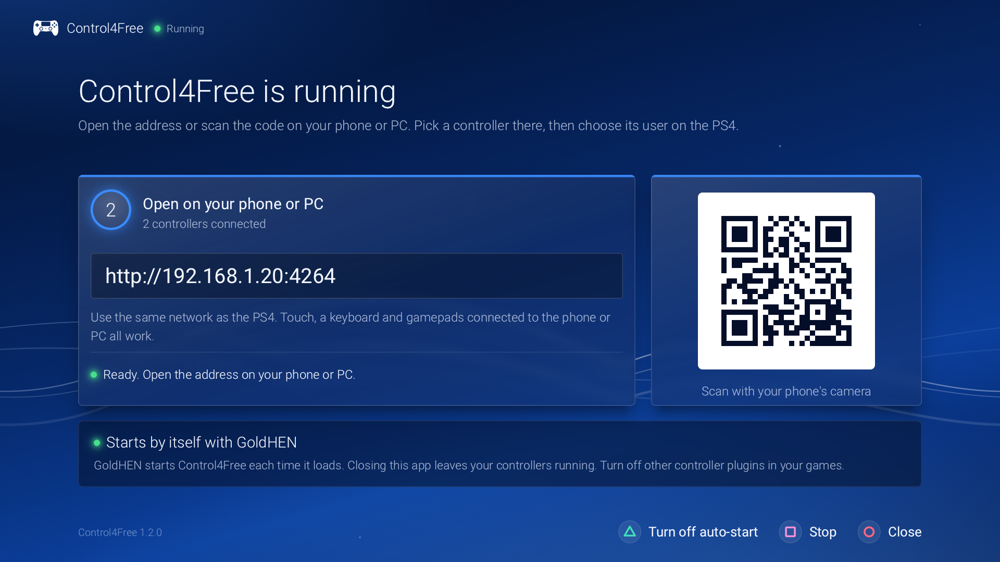

<h1 align="center">Control4Free</h1>

  
  
  
  

**Use your phone or PC as a PS4 controller everywhere: on the home screen, at sign-in, and in every game.**

Control4Free adds up to four extra DualShock 4 controllers to a jailbroken PS4. Open its page in a browser on
your network, pick a controller, and choose who's playing on the PS4's own *"Who's using this controller?"*
screen. Play with touch, a keyboard, or the gamepad you already have: Xbox, DualSense, Switch Pro and most
others work through the phone or PC. There's nothing to install on the phone or computer.

## Why it's different

Controller plugins live inside games, so they can't reach the home screen or the sign-in screen. Control4Free
is a GoldHEN payload that goes through Sony's own virtual-device system, the one Remote Play uses. The PS4
sees a real controller, so it works wherever a DualShock does:

- **on the home screen and in every menu**, PS button included;
- **at sign-in**, through the PS4's own user picker, for real users and guests alike;
- **in every game**, with no per-game setup.

## Features

- **Up to four controllers**, from as many phones, tablets or computers as you like.
- **A full DualShock 4 on the screen**: analog sticks, a two-finger touchpad, L3/R3, PS, Share and Options.
  Move, resize or hide any button with the layout editor; each device keeps its own layout.
- **The gamepads you already have.** Connect one to the phone or PC and give it a controller. One computer
  can run all four.
- **A keyboard**, with keys you can change.
- **Fast.** Input reaches the console the moment it arrives, at a DualShock 4's own rate while you play.
- **An app on the PS4** that shows the address and a QR code, how many controllers are connected, and starts
  or stops Control4Free.
- **Starts by itself.** One button in the app sets up GoldHEN's AutoRun, so Control4Free is ready after
  every restart.
- **On your phone's home screen**, like an app.
- **Stays awake**: your phone's screen doesn't turn off while you play.
- **Gets through rest mode.** After the PS4 wakes up, open the page and pick your controller again.

## Quick start

1. Download `Control4Free-1.0.0.pkg` from the [latest release](https://github.com/MoHadiShibli/Control4Free/releases/latest).
2. Install it with GoldHEN's Package Installer: **Settings → Debug Settings → Game → Package Installer**, from a
   USB drive or `/data/pkg/`.
3. Open **Control4Free** from **Library → Applications** and press **Cross**. It sets up auto-start and
   starts Control4Free.
4. On your phone or PC, scan the QR code or open the address shown, for example `http://192.168.1.20:4264`.
   Pick a controller, then choose your user on the PS4.

New to GoldHEN packages? The **[installation guide](docs/installation.md)** walks through every step.

## Screenshots

| Home screen on a phone | On a PC | The app on the PS4 |
|---|---|---|
|  |  |  |

## Documentation

- **[Installation](docs/installation.md)**: requirements, installing, auto-start, updating, uninstalling.
- **[Playing](docs/playing.md)**: signing in, touch, keyboard and gamepads, the layout editor, settings.
- **[Troubleshooting](docs/troubleshooting.md)**: the messages you might see and what to do about each.
- **[How it works](docs/how-it-works.md)**: the virtual-device API, sign-in, and what runs where.
- **[Protocol](docs/protocol.md)**: the WebSocket protocol between the page and the console.
- **[Security](SECURITY.md)**: what being open on your home network does and doesn't mean.
- **[Contributing](CONTRIBUTING.md)**: building, testing and code style.
- **[Changelog](CHANGELOG.md)**.

## Requirements and compatibility

- A PS4 with GoldHEN. Tested on firmware 10.01 with GoldHEN v2.4b18.10. Auto-start and starting Control4Free
  from GoldHEN's menu need v2.4b18.10 or later.
- A phone, tablet or computer with a browser, on the same network as the PS4.
- Turn off other GoldHEN controller plugins in games you play with Control4Free. A plugin that takes over a
  signed-in user's controller can stop games from reading the virtual ones.
- A Remote Play session (chiaki-ng, for example) works alongside Control4Free.

## Limitations

- **No rumble, light bar or motion yet.** The PS4 does send rumble and light-bar changes to the virtual
  controllers; passing them to the phone is planned for 1.1.
- **One controller is added at a time.** If two people pick at once, the second is asked to try again a
  moment later.
- **Rest mode signs everyone out**, so controllers have to be picked again after the PS4 wakes up, just like
  real ones.
- **No pairing or password.** Anyone on your network can take a free controller. Read [SECURITY.md](SECURITY.md)
  and keep port 4264 off the internet.

## Support

Found a bug? [Open an issue](https://github.com/MoHadiShibli/Control4Free/issues/new/choose); I maintain this
project and read every report. If Control4Free is useful to you, you can help keep it going on
[Ko-fi](https://ko-fi.com/mohadishibli).

## Credits

Control4Free's virtual-device code is ported from [SplashDown](https://github.com/seregonwar/SplashDown) by
seregonwar. The other code, fonts and artwork it uses, and their licenses, are listed in
[THIRD_PARTY.md](THIRD_PARTY.md).

### Built with AI help

Control4Free was built with the help of AI models, **Claude Opus 5.5** by Anthropic and **Astra GPT-6** by
OpenAI, which worked on the code, tests and documentation with me. AI-written code can look right and still be
wrong. Reviews are very welcome: if you spot AI slop (dead code, wrong assumptions, needless complexity),
please [open an issue](https://github.com/MoHadiShibli/Control4Free/issues) or send a pull request.

## License

Control4Free is free software under the [GNU General Public License v3](LICENSE).
Copyright © 2026 MoHadiShibli.
