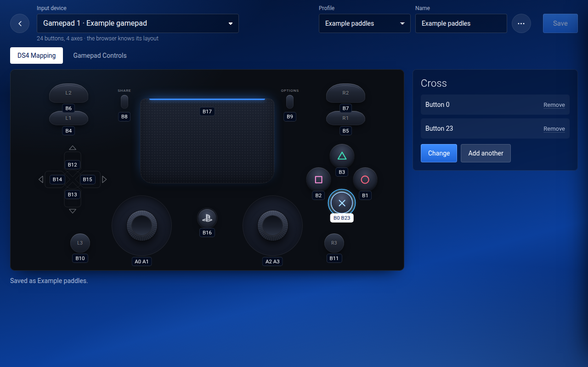
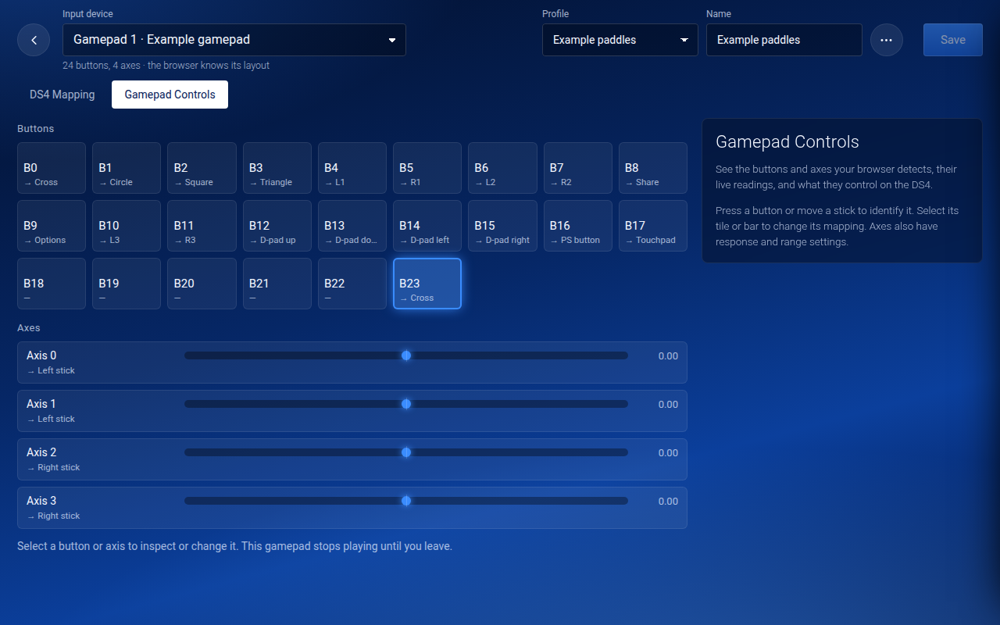

# Gamepad mapping

Map the buttons and axes a browser exposes from gamepads, wheels, guitars and other input devices to one of
the four virtual DualShock 4 controllers. Wheel and guitar model compatibility remains unverified; these
are mapping capabilities, not native accessory emulation. You map on a picture of a DualShock 4. The
keyboard is mapped the same way. Mappings are kept in the browser, like your layout.

With several gamepads on Chrome or Edge for Windows, Xbox/Guide presses can be reported on the wrong
gamepad by the browser. Check **Gamepad Controls** first; see the
[Xbox-button workaround](troubleshooting.md#gamepads). Mapping cannot restore an input's missing source.

## Change a button

1. Connect the gamepad to the phone or computer and press a button on it, so it shows up under **Gamepads on
   this device**.
2. Press **Mapping** on its row. You can also go to **☰ → All settings → Gamepads** and press **Mapping**.
3. The **DS4 Mapping** tab shows a DualShock 4. Each control is labelled with what drives it: **B3** is button 3 on your
   gamepad, **A0** is axis 0, and **—** means nothing. Press anything on the gamepad and the control it drives
   lights up.
4. Click a control, press **Change**, then press the gamepad button you want for it.
5. Press **Save**.

**Add another** gives a DS4 control another input, for example a back paddle that also presses Cross.
Cross stays pressed until both inputs are released. **Remove** takes a binding away. Choosing **Change**
moves the selected input from its previous control. The engine also accepts profiles with one input
driving multiple outputs; see [Advanced profiles](#advanced-profiles).

While you map a gamepad, it stops playing. Its controller stays connected, and everyone else keeps playing.
When you leave, a button you're still holding does nothing until you let go of it, so nothing gets pressed by
accident. **Back** with changes that aren't saved asks you to press it again before it throws them away.

On a phone, the picture is small, so a list of the controls sits under it: tap one there instead.

## Sticks and triggers

Click a stick, press **Change**, and move the stick you want all the way to the right, then all the way down.
If you move it the other way, that direction is reversed for you. A wheel works the same way: turn it right,
then press **Cancel** when the page asks for down.

A stick's panel shows where it is: the grey dot is the stick itself, the lit dot is what the PS4 gets. Under
**Response**:

- **Dead zone**: how far the stick moves before it counts. The ring around the centre shows it. Raise it if a
  worn stick drifts.
- **Curve**: **straight** follows the stick exactly; **gentler** gives finer control near the centre.
- **Reverse** turns a direction round.

For L2 and R2, the bar shows how far the trigger is pulled. A trigger or pedal that the browser reports as an
axis is set to its whole travel when you press **Change** and push it.

## Gamepads the browser doesn't know

When the browser doesn't know a gamepad's layout, its row says *buttons may be mixed up*, and the page starts
from the standard layout as a guess. Wheels, guitars, arcade sticks and many cheap USB gamepads are like this.
Click each control on the picture that's wrong and change it.

A D-pad that the browser reports as a single axis (a "hat") works the same way: click a D-pad direction, press
**Change**, and press that direction.

## Gamepad Controls

The **Gamepad Controls** tab shows every button and axis on the gamepad, live, and what each one drives.
Press a button or move a stick to identify its tile or bar. This view starts with the physical input;
**DS4 Mapping** starts with the DS4 control you want to change. The guide panel follows the selected tab.
The screenshots use an emulated gamepad to illustrate the editor.

Click one to:

- **Make it drive…** another control: click that control on the picture. For a stick, choose the direction.
- set its **Dead zone**, **Curve** and **Reverse**; a small graph shows the curve. For an axis that presses a
  button, **Presses at** sets how far.
- **Set its range**, for an axis that doesn't use its whole range. It asks what the axis is: a stick or wheel
  (let go, then all the way one way, then the other), a pedal or trigger (let go, then all the way), or a D-pad
  hat (let go, then up, right, down and left).

The hat wizard infers diagonal values from the four directions. Test every diagonal afterward. A hat with
different encoding needs its actual neutral and eight direction values in an advanced profile.

## Profiles

A mapping is saved as a profile, named in the **Name** box. Choose that profile for each connected gamepad
that should use it. **Save** updates every connected gamepad already using that profile; the editor lists
the others affected. **Save as a new profile** branches a profile for only the selected gamepad.
The browser remembers the last saved profile choice for matching device IDs, mapping types and input
counts when a gamepad reconnects. The **Profile** list switches between your profiles and the
**Standard layout**, which is immutable: editing and saving it creates a named profile.

The **⋯** menu has **Save as a new profile**, **New empty profile**, **Back to the standard layout**, **Export to a
file**, **Import from a file**, and **Delete this profile**, which asks you to press it twice. A profile made for a
different gamepad says so: press **Fit it to this gamepad** to drop the inputs this one doesn't have.

Imports open as drafts and do not overwrite an existing profile. Review bindings and calibration before
**Save**, especially after fitting a different device. Missing inputs must be removed or corrected.
Profiles use browser storage under `c4f.gamepadProfiles`; export them as a backup. Invalid data falls back
safely, and a storage warning means changes will last only for this session.

Several gamepads can play as the same controller, for example a wheel and a separate set of pedals: pick the
same controller on both rows.

## Advanced profiles

Export a profile, edit its JSON, then import it for review. The file has
`format: "control4free-controller-profile"`, `schema: 1`, and a `profile` containing its ID, name,
device signature, bindings and calibration. Unknown file versions are rejected. Unknown versions already
in browser storage are preserved, with changes limited to the session.

Bindings can use a digital or pressure-sensitive button, a full axis, its positive or negative half,
a calibrated pedal, or a hat direction. Outputs are DS4 buttons, stick axes or directions, and L2/R2
pressure. This permits button-to-stick, button-to-trigger, axis-to-button and axis-to-trigger mapping.
Duplicate a binding with a different `output` to make one input drive multiple actions.

Each binding includes `invert`, `deadzone`, `saturation`, `exponent`, `activate` and `release`.
The response curve is a power curve with exponent 1 for linear response. Analog-to-button bindings default
to 50% activation and 40% release to avoid jitter. Default stick bindings retain the previous transfer
behavior through `legacy`; remove that property when opting into tuning.

Centered-axis calibration stores `min`, `center` and `max`, including asymmetric ranges. Pedal calibration
stores `released` and `full`, which may be reversed. For combined pedals, use opposite halves of the axis.
Hat calibration stores `values` in the order neutral, up, up-right, right, down-right, down, down-left,
left, up-left, plus a `tolerance` that separates those values.

Inputs sharing a controller are merged: buttons use OR, triggers use maximum pressure, opposing digital
stick directions cancel, and analog sticks use the strongest displacement. Equal opposing analog
contributions cancel. Values are converted to DS4 bytes after merging.

## The keyboard

**Keyboard keys** at the bottom of the home screen, or **All settings → Keyboard → Choose keys**, opens the same
picture with the keyboard's keys on it. Click a control, then the key, and press its new key. Sticks and the
touchpad have one key per direction or corner. **Standard keys** puts them all back. Keys with Ctrl, Alt or the
Windows key can't be used.

## Limits

- Only what the browser can see can be mapped. Some extra buttons, like paddles, either aren't shown to
  browsers or send the same button as another one.
- The PS4 always sees a DualShock 4. Native wheel/guitar identity and wheel force feedback are not provided.
  Native accessory emulation is unproven and outside this release; existing supported gamepad rumble remains.
- A combined pedal axis can drive separate outputs, but simultaneous pedal positions lost by the device
  cannot be recovered.
- The page reads gamepads about 60 times a second, so a press shorter than that can be missed.
- DS4 output uses 8-bit stick and trigger values; extra precision in a physical device is reduced.
- Macros, turbo, toggles, chords and shifted layers are outside this release.

When reporting compatibility, include the controller model, browser and OS versions, connection mode,
exposed button/axis counts, working mappings and remaining limitations. Emulated-input tests are not
real-device compatibility reports.
